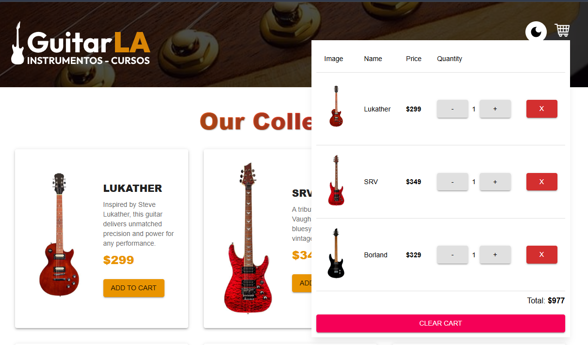

# 🎸 GuitarLA – E-Commerce App


## 🧠 About the Project

A modern and responsive e-commerce web application for guitar sales, built
with  
**React**, **TypeScript**, and **Material UI**.  
Features a dynamic shopping cart powered by **useReducer**, theme toggling  
(light/dark), and persistent cart storage using **localStorage**.  
Designed with reusable components, clean architecture, and responsive layouts  
for all devices.

---

## 🎥 Demo Video

**Live Demo:**

[👉 Watch the Demo](https://guitarla-ecommerce-app.netlify.app)

---

## 📸 Screenshots

### 🖼️ Product Catalog


### 🖼️ Product Catalog - 2


### 🛒 Shopping Cart



---

## 🚀 Features

✅ Add and remove guitars from the cart  
✅ Increase or decrease item quantity with limits  
✅ Real-time cart total calculation  
✅ Persistent cart using localStorage  
✅ Light/Dark theme toggle with MUI  
✅ Responsive Material UI components  
✅ Accessible keyboard-friendly design  
✅ Strongly typed with TypeScript for scalability

---

## 🧠 Tech Stack

- ⚛️ **React 18** + **TypeScript**
- 🎨 **Material UI (MUI)** for styling and theming
- 🔄 **useReducer** for global state management
- 💾 **localStorage** for persistence
- ⚡ **Vite** for fast builds and hot reloading
- 🧱 **Custom CSS** for animations and layout enhancements

---

## 🗂️ Project Structure

```
src/
├── components/ # UI components (Header, GuitarCard)
├── data/ # Static guitar catalog (db.ts)
├── reducers/ # Cart reducer logic (add, remove, update)
├── types/ # TypeScript interfaces (Guitar, CartItem)
├── theme.ts # MUI theme configuration (light/dark)
├── App.tsx # Main application logic
├── main.tsx # Theme provider and app entry point
└── index.css # Custom global styles and animations

```

---

## 💡 What I Learned

- Implemented **state management with useReducer** for scalable e-commerce
  logic.
- Created **reusable and type-safe components** in React with TypeScript.
- Applied **Material UI theming** with persistent light/dark mode.
- Built **responsive layouts** without external frameworks.
- Managed **localStorage state synchronization** for cart persistence.

---

## 📦 Installation

```bash
# Clone the repository
git clone https://github.com/guillevarelabarros/react-guitarla-ecommerce.git
cd react-guitarla-ecommerce

# Install dependencies
yarn install

# Start development server
yarn dev
```

## 👨‍💻 Author

Guillermo Ignacio Varela Barros

- 🔗 LinkedIn: https://www.linkedin.com/in/guillevarelabarros

- 💻 GitHub: https://github.com/guillevarelabarros

## 🔗 Useful Links

📹 Demo: https://guitarla-ecommerce-app.netlify.app

💻 Repository: https://github.com/guillevarelabarros/react-guitarla-ecommerce

“Clean design meets clean code — every string counts 🎶”
